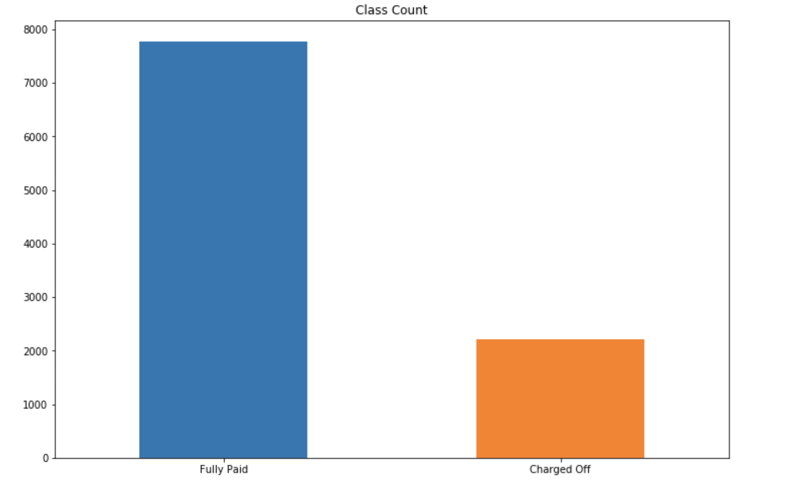
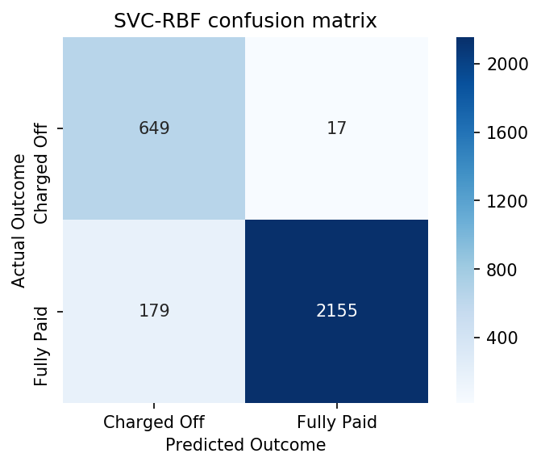

# Deal or no Deal?

**Predicting Lending Club Outcomes**

## Description:

The purpose of this project was to use machine learning classification algorithims to predict classes based on a dataset. For my project, I used 2015 data from [Lending Club](http://www.lendingclub.com), which is a peer to peer money lending platform, to predict whether a loan will be "Fully Paid" or "Charged Off" (binary classification).

## Project Design:

I started this project by identifying and downloading the [dataset](https://www.lendingclub.com/info/download-data.action) I wanted to use for this project. After conducting my analysis, I had to determine what metric I am trying to optimize for with my classification. With this in mind, my proposed buisness case was to: **Optimize for precision of 'Fully Paid' loans in order to predict which loans would be "low risk" with the goal of maximizing return on investment for a lender.**

## Tools

- Pandas
- Matplotlib
- GridSearchCV
- Sklearn
- Searborn
- Train/test split
- Cross Validation
- Random Oversampler

Were a few of the packages that I utilized on this project for analysis and visualization. I began working on a flask app, but decided to push that for future work in order to optimize my models.

## Data

As mentioned above, the dataset I used was 2015 LendingClub.com accepted loans. This was a large dataset with originally more than 500k observations. After I decided to do a binary classification, I was able to reduce the dataset down to 300k usable observations. As I was running my models, the processing time was very long for each 300k observation model. With respect to time constraints for my project, I decided to take a random sample of 10k records to use as my training set.

### Class Imbalance

Within the dataset, there was a big class imbalance. The classification I was attempting to predict, 'Fully Paid', was a much more frequent class than 'Charged Off' as seen below:

With this in mind, I decided to utilize sklearn's random oversampling technique to balance out the classes. This allowed me to compensate for the lack of observations for the 'Charged Off' class, which will allow me to generalize better overall.

### Feature Selection

My strategy for attacking feature selection went along these lines:

- Eliminate all redundant features (ex: Accounts opened in last 6 months vs accounts opened in last 12 months)
- Eliminate features that were unfairly descriptive (ex: Amount of loan that has already been paid off). These features would be unfair to use on the premise that the model is meant to be used at the genesis of a loan, rather than after time has already passed.
- Utililized Random Forests and the XGB Classifiers feature importance quantification. This allowed for an empirical approach to feature selection.

 

After eliminating features based on this criteria, I reduced the set down to 63 features, which was still larger than I was hoping, but I continued onto modeling with this dataset.

## Algorithims

One of my goals for this project was to understand and utilize a variety of different algorithims and the use cases for them. The table below describes all of the algorithims I used:

|       Algorithm        | Precision on Test Set |
| :--------------------: | :-------------------: |
|        **SVC**         |       **0.92**        |
|    XGB   Classifier    |         0.89          |
|  k-Nearest  Neighbors  |         0.87          |
|    Decision   Tree     |         0.87          |
|      Linear   SVC      |         0.86          |
|    Random   Forests    |         0.79          |
|   Dummy   Classifier   |         0.77          |
| Logistic   Regression  |         0.69          |
| Gaussian   Naïve Bayes |         0.65          |

The dummy classifier, which just predicts the majority class for every prediction, preformed quite well because we are predicting the majority outcome with 'Fully Paid'. Going up from the dummy, we can see that most of the models did improve on the baseline. 

Using an exhausting GridSearchCV search with a multitude of different hyper-parameters, I was able to obtain a precision of 92% on my test set using the support vector machine algorithim, which shows that my model does generalize quite well on new data. Below is a confusion matrix of my highest performing model.

We can see here that my model is predicting 2,155 of the 2,334 observations correctly. 

